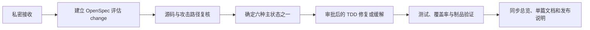

# 安全策略

## 支持范围

| 版本或维护线 | 状态 | 说明 |
| --- | --- | --- |
| `1.3.x-bjca-patch` 当前源码 | 维护中 | 已完成 Java 8、Spring Framework 5.3.x、NES GAV、listener 与 CVE 源码修复验证；RELEASE 尚未完成 |
| `1.3.4-nes.patch.1-SNAPSHOT` | 本地已验证开发版本 | 已完成双矩阵、覆盖率、制品和 Maven/Gradle 消费者验证；CVE 主状态仍为“修复中”，不可替代远端 RELEASE |
| `1.3.4-nes.patch.1` | 目标 RELEASE | 尚未发布；只有完成兼容性、CVE、制品和 Nexus 门禁后才进入支持范围 |
| 官方 Spring Retry 1.3.x | 上游 EOL | 本 fork 不代表上游提供支持，需依据本仓库制品和漏洞证据判断 |
| Spring Retry 2.x | 不在本仓库范围 | 由对应上游或其他维护线处理 |

当前已知安全状态以 [漏洞状态总览](doc/VULNERABILITY_REPORT.md) 为唯一入口。GAV、版本字符串或 fork 名称改变不等于漏洞已经修复。

## 私密报告渠道

请不要通过公开 GitHub Issue、公开 Pull Request、群聊或普通邮件列表披露尚未公开的漏洞细节。

1. BJCA 内部人员应在组织批准的安全/缺陷工单系统中创建私密工单，并指派本仓库维护负责人。
2. 无法访问内部工单系统时，请通过现有的组织私密通讯渠道联系仓库管理员，获取当前批准的安全报告入口。
3. 在维护者确认接收渠道前，只提供最小必要摘要，不发送可利用样例、凭证、客户数据或生产地址。

仓库不固化个人邮箱、账号、token 或内部系统 URL，以免人员变化或敏感信息泄露导致渠道失效。

## 报告内容

建议包含：

- 受影响的 GAV、分支、commit 和运行环境；
- 漏洞类型、攻击前提、输入来源和可复现步骤；
- 受影响类、方法、调用链和配置；
- 可用性、机密性、完整性和下游影响；
- 已尝试的缓解方式及其限制；
- 是否已向其他组织或公开渠道披露；
- 安全的联系方式和期望协调窗口。

请使用脱敏数据。不得提交真实密码、token、私钥、Maven settings、Nexus 凭证或客户数据。

## 响应流程

- 新报告进入 active OpenSpec 后，主状态使用“修复中”，阶段可以是“评估中”。
- Java 源码修复必须单独获得明确授权并严格执行 RED、GREEN、REFACTOR。
- “已修复”要求源码、测试和目标制品证据闭环；仅提交代码或提高版本号不足以完成状态转换。
- “已缓解”和“暂缓”必须记录负责人、残余风险和复审日期。

状态定义和证据要求详见 [维护要求](doc/REQUIREMENTS.md) 与 [漏洞状态总览](doc/VULNERABILITY_REPORT.md)。

## 披露与发布

- 未公开漏洞的披露时间和内容由维护者、安全负责人及上游协调决定。
- 修复不得混入无关重构或未经批准的新功能。
- Nexus RELEASE 为不可变制品；不得删除、覆盖或以相同版本盲目重发。
- 发布后发现缺陷时，必须创建新 OpenSpec 并提升 `-nes.patch.N` 版本。
