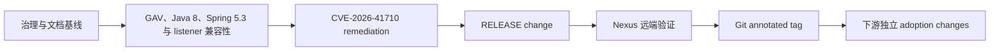

# Spring Retry NES 发布指南

本文描述通用、不可变、证据驱动的发布流程。`1.3.4-nes.patch.1` 已按该流程完成 Nexus RELEASE、远端复验和 Git annotated tag。

## 1. 发布前置 change

RELEASE change 只能在以下 change 全部验证并归档后开始：



任何前置任务、测试、覆盖率或 CVE 制品证据未完成时，不得生成或部署 RELEASE。

## 2. 固定版本与制品集

首个目标版本：

```text
cn.bjca.footstone.bpring.retry:bjca-footstone-bpring-retry:1.3.4-nes.patch.1
```

前一开发版本：

```text
cn.bjca.footstone.bpring.retry:bjca-footstone-bpring-retry:1.3.4-nes.patch.1-SNAPSHOT
```

必需制品：

- 主 JAR；
- POM；
- sources JAR；
- javadoc JAR；
- Nexus 要求的摘要和签名/校验资产。

所有制品必须来自同一 Git commit 和同一次候选构建。任一 classifier、版本或 commit 不一致时，整个候选集作废并重新生成。

## 3. 实施前安全检查

记录：

```bash
git branch --show-current
git rev-parse HEAD
git status --short --branch --untracked-files=all
git diff --name-only
git diff --cached --name-only
openspec list --json
```

门禁：

- 分支、HEAD 和 active release change 明确；
- 无关 tracked 修改必须保留并停止可能覆盖它们的操作；
- `.codex/`、`.cursor/` 等本地工具内容不得误入发布 commit；
- 发布前再次向用户报告可恢复点；
- Nexus 部署必须获得单独明确授权。

## 4. 工具链

主验证必须使用真实 JDK 8。当前维护机已发现：

- SDKMAN Java `8.0.472-amzn`、`8.0.482-kona`；
- Maven `/Users/anan/dev/apache-maven-3.8.2/bin/mvn`；
- 用户 `~/.m2/settings.xml` 和本地 repository。

示例：

```bash
sdk use java 8.0.472-amzn
java -version
/Users/anan/dev/apache-maven-3.8.2/bin/mvn -version
```

本仓库没有 Gradle 构建。Gradle 只用于下游消费者 smoke test；本 change 复用 `~/dev/gradle-7.6.3` + JDK 8 的开发基线，并针对 RELEASE 候选重新执行必要的本地消费者验证。

## 5. 本地构建门禁

使用当前 release change 批准的 Maven/Make 命令执行。开发阶段已经完成以下宽泛门禁，本次不因版本字符串变化重复运行 `make verify` 或 `make test`：

```bash
mvn clean verify
mvn install
make clean deploy
```

本次唯一必要的本地发布构建为 `make install-local`；Maven 不使用 `-T`，并且任何 Make、Maven、Gradle 命令都不得与其他项目并发。

必须验证：

- Java 8 编译和运行；
- 官方 Spring Framework 5.3.39 隔离测试全绿；
- NES Framework `5.3.39-nes.patch.1` 默认产品链全绿；
- 无失败、错误或未经批准的 skipped test；
- JaCoCo 对新增核心逻辑/复杂算法达到至少 60%；
- CVE 攻击路径、缓存隔离和 listener 兼容性测试通过；
- JaCoCo 不进入运行时依赖树；
- 修复 SNAPSHOT 已生成并上传主 JAR、POM、sources JAR、javadoc JAR，通过 Maven/Gradle 各 2-test 本地 smoke test，并通过隔离 Nexus 四件套与 JDK 8 远端消费者验证；这些结果不能替代 RELEASE 远端验证。

测试报告和覆盖率位置见 [测试指南](TESTING.md)。

## 6. POM 与依赖验证

```bash
mvn help:effective-pom -Doutput=target/effective-pom.xml
mvn dependency:tree -Dverbose -DoutputFile=target/dependency-tree.txt
```

RELEASE 候选必须满足：

- 项目版本精确为 `1.3.4-nes.patch.1`；
- 所有内部 `cn.bjca.footstone` 依赖都是批准的 RELEASE，不含 `-SNAPSHOT`；
- 默认 POM 使用 NES Spring Framework GAV；
- dependency tree 不含官方 Spring Retry；
- 产品链不含官方/NES Spring Framework 重复类；
- `optional`、`test` 和 BOM import 语义与批准设计一致；
- POM 包含 BJCA fork 元数据、Apache 2.0 许可证和上游溯源。

## 7. JAR 内容验证

示例：

```bash
jar tf target/bjca-footstone-bpring-retry-1.3.4-nes.patch.1.jar
unzip -p target/bjca-footstone-bpring-retry-1.3.4-nes.patch.1.jar META-INF/MANIFEST.MF
shasum -a 256 target/bjca-footstone-bpring-retry-1.3.4-nes.patch.1*.jar
```

当前 Nexus SNAPSHOT 已检查：

- package 仍为 `org/springframework/retry/` 和 `org/springframework/classify/`；
- 没有意外嵌入依赖 JAR、凭证或本机路径；
- MANIFEST/META-INF 版本、许可证和 Maven metadata 一致；
- JAR 包含已批准的 listener 兼容性和 CVE 缓存修复代码特征；
- 包含 `AbstractMapRetryContextCache`、双参数 cache 构造器、普通/断路器双 setter 和双缓存路由；
- Nexus SNAPSHOT 验证不能替代目标 RELEASE 的远端重新下载、摘要和消费者证据；
- sources/javadoc 与主 JAR 版本一致。

## 8. 消费者 smoke test

当前基线已建立干净 Maven/Gradle 7.6.3 本地消费者和 JDK 8 Nexus SNAPSHOT 远端消费者；正式 RELEASE 仍必须重新建立干净消费者：

1. 只从本地候选或批准的 Nexus repository 解析 NES Retry；
2. 使用 Java 8 和 NES Spring Framework 5.3.39；
3. 编译并运行最小 `@EnableRetry`、listener、有状态重试和断路器场景；
4. 扫描 dependency tree，确认没有官方/NES 双份类。

Gradle 消费者验证使用相同原则，并确认目标 GAV 可被 Gradle metadata/POM 正确解析。消费者临时工程放在批准的临时目录，不提交无关内容。

## 9. 发布 commit 冻结

本地门禁通过后，创建一个专用 release commit，包含：

- RELEASE 版本和内部 RELEASE 依赖；
- 已批准的 POM/GAV 元数据；
- README、GAV Mapping、Compatibility、Testing、Vulnerability Report 和 Release Notes；
- 不包含无关源码、工具目录或临时产物。

记录 release commit SHA。后续候选构建、Nexus 部署和 tag 必须绑定该 SHA，部署前不得再修改源码。

## 10. Nexus 目标不存在检查

部署前从本地候选集枚举所有目标 GAV、classifier 和校验资产，对 Nexus RELEASE 执行只读查询。

只有当全部资产均不存在时才能继续。发现以下任一情况必须停止：

- 完整版本已存在；
- 只有 POM、JAR、classifier 或 checksum 的部分资产；
- metadata 已记录目标版本；
- 返回结果无法确认是不存在还是权限/网络错误。

不得删除、覆盖或清理远端 RELEASE 来“腾出”版本。

## 11. 单独部署授权

完成全部本地门禁和目标不存在检查后，向用户报告：

- release commit；
- 完整目标制品集；
- 测试和覆盖率；
- effective POM/依赖树；
- 本地消费者结果；
- Nexus 不存在检查结果；
- 失败和回滚策略。

只有协调主会话完成全部门禁复核并取得 CLI 执行 token 后，才可使用 Maven settings 中批准的 `server` id 执行一次部署。无需用户重复回显仪式性 token；文档和命令记录不得包含真实密码、token 或私钥。

POM 已使用属性化 `distributionManagement`：非 SNAPSHOT 版本由 Maven 选择 server id `releases`。完成前述检查和再次授权后，标准命令为：

```bash
make deploy ALLOW_RELEASE_DEPLOY=true
```

Makefile 会先校验项目版本不是 SNAPSHOT、显式确认变量和 `nexusReleaseUrl`，然后运行完整 `mvn clean deploy`。不得通过跳过测试、覆盖率、Javadoc 或 classifier 缩短发布流程；不得把该命令与 Git tag/push 绑定。

## 12. 远端重新下载验证

部署命令成功不代表发布完成。必须从 Nexus 重新下载：

- POM；
- 主 JAR；
- sources JAR；
- javadoc JAR；
- 所有要求的 checksum/签名。

对远端资产验证：

- HTTP 状态、大小和完整性；
- SHA-256 与本地候选一致；
- POM 无内部 SNAPSHOT 和官方坐标回流；
- JAR package、版本和修复代码特征；
- 干净 Maven/Gradle 消费者只从远端解析并通过 smoke test。

全部通过后，发布状态才能成为 Nexus 已验证。

## 13. 部分失败与不可变策略

如果部署后任一必需资产缺失、内容不一致或消费者失败：

- 标记为 partial-failure；
- 停止对同版本的任何重新部署；
- 不删除或覆盖已有资产；
- 建立新的 OpenSpec change；
- 提升为新的 `1.3.4-nes.patch.N`；
- 在 Release Notes 和漏洞文档记录原版本状态。

## 14. Git tag

只有 Nexus 远端验证完成后，才能在精确 release commit 创建 annotated tag：

```bash
git tag -a v1.3.4-nes.patch.1 <release-commit> -m "Release 1.3.4-nes.patch.1"
```

push 后验证远端 branch/tag 指向。若仅 Git push 失败，只重试 Git 操作，不得重新部署 Nexus。

## 15. 发布后文档和下游

同一 release change 更新：

- `doc/RELEASE_NOTES.md` 的 commit、tag、GAV、Nexus 和验证结果；
- `doc/VULNERABILITY_REPORT.md` 与单篇 CVE 文档；
- README、Quick Start、GAV Mapping 和 Compatibility；
- OpenSpec evidence 和 tasks。

Spring Boot 2.7、Spring Kafka 2.9 和业务消费者必须在各自仓库创建独立 adoption change，不能由本仓库直接批量修改。
