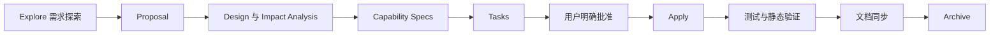

# Spring Retry NES 维护要求

本文档是本仓库的人机协作、开发、安全和交付基线。任何会改变源码、测试、构建、依赖、GAV、文档或发布制品的工作，都必须先通过完整 OpenSpec 流程更新本要求或对应 capability。

## 1. 当前范围与维护目标

| 项目 | 当前已验证事实 | 后续目标 |
| --- | --- | --- |
| 分支 | `1.3.x-bjca-patch` | 继续维护该 1.3.x fork |
| 当前 RELEASE GAV | `cn.bjca.footstone.bpring.retry:bjca-footstone-bpring-retry:1.3.4-nes.patch.1` | 已完成 Nexus、消费者和 Git tag 验证 |
| 下一开发 GAV | 尚未设置 | 后续开发必须使用新的 `-SNAPSHOT` 版本，不得改写已发布 RELEASE |
| Java | POM、真实构建和字节码均为 Java 8 | 继续以真实 JDK 8 作为发布门禁 |
| Spring Framework | 默认 NES `5.3.39-nes.patch.1`；官方 5.3.39 隔离验证全绿 | 仅承诺 Spring Framework 5.3.x |
| 构建系统 | Maven + 根 Makefile 入口 | Makefile 封装 Maven/OpenSpec 和受控 deploy；不为本仓库新增 Gradle 构建或 Git 发布 target |
| Java package | `org.springframework.retry.*`、`org.springframework.classify.*` | 保持不变 |

`1.3.4-nes.patch.1` 已完成 CVE-2026-41710 的源码、测试、覆盖率、Nexus 四件套、隔离消费者和远端 Git tag 验证，主状态为“已修复”。正式支持状态以对应 OpenSpec、远端制品和 Git 证据为准，版本字符串或文档声明不能替代证据。

本维护线的缓存安全合同为：普通 map/soft-reference cache 默认使用有界访问顺序 LRU，显式 `(capacity, false)` 保留严格 fail-fast；普通有状态重试与断路器使用独立 cache，注解配置使用 `retryContextCache` 与 `circuitBreakerRetryContextCache` 两个约定名称。后续变化必须重新执行完整 OpenSpec、TDD、影响分析和文档同步。

## 2. 强制 OpenSpec 生命周期

每个 change 必须按以下顺序执行：



- 即使只修改一行配置或一份文档，也不得绕过完整流程。
- 未达到 apply-ready 或未获得明确批准时，不得修改正式源码、配置或项目文档。
- 任一 task、测试、覆盖率、制品验证或文档同步未完成时，不得归档。
- 后一个 change 不得借用前一个 change 的未完成任务或审批。

## 3. 人工确认与授权边界

实施前必须向用户说明：

1. 问题原因和当前证据；
2. 建议方案及备选方案；
3. 受影响的模块、上下游、接口和运行行为；
4. 安全、兼容性、发布和回滚风险；
5. 本次明确不处理的事项。

Java 源码、POM、依赖、发布、跨仓库、批量重品牌和破坏性操作必须在 tasks 中设置明确审批点。评估或文档审批不得解释为源码修改授权；Makefile 提供 deploy 能力不等于部署授权，Nexus SNAPSHOT/RELEASE 写入都必须在对应门禁通过后再次单独授权。

## 4. 上下文理解与影响分析

修改前必须阅读相关 proposal、design、specs、tasks、当前实现、现有测试和永久文档。Impact Analysis 至少覆盖：

- 上游来源、补丁 commit 和许可证；
- 当前模块、公共 API、package/import 和反射行为；
- Maven POM、dependency management、scope、optional 和 test 语义；
- Spring Boot、Spring Kafka、直接消费者、Nexus 和 SCA；
- 运行行为、资源使用、并发、日志、异常和回滚；
- 数据安全、敏感信息和供应链风险。

三个及以上组件、分支或步骤存在依赖关系时，design 必须提供流程图、架构图或等价可视化。

## 5. Git 与可恢复性门禁

大范围、跨模块、删除、覆盖、历史修改或发布前必须检查：

```bash
git branch --show-current
git status --short --branch --untracked-files=all
git diff --name-only
git diff --cached --name-only
```

- 保留所有与当前 change 无关的 tracked/untracked 内容。
- 不得使用会覆盖用户工作的破坏性命令。
- 批量变更和发布前必须向用户报告分支、工作树和可恢复点。
- 已发布 RELEASE 不得通过删除或覆盖回滚，只能发布新的 NES patch 并由消费者显式升级。

## 6. Java 代码严格执行 TDD

所有 Java 生产代码变更必须遵循：

1. **RED**：先建立在当前实现上稳定失败的最小回归测试，并记录命令与失败原因；
2. **GREEN**：编写使测试通过的最小实现，不混入无关重构；
3. **REFACTOR**：在定向测试持续通过的前提下整理实现；
4. 运行受影响测试、全量测试、兼容性矩阵和覆盖率验证；
5. 同步 User Manual、Testing、Release Notes 和 CVE 文档。

本分支使用 Java 8 和现有 JUnit 4 风格。上游补丁若使用 JUnit 5、AssertJ 或较新 Java 语法，必须等价移植，不得为方便整体升级测试栈。

## 7. 测试覆盖率

- 新增核心业务逻辑或复杂算法的类级或变更范围覆盖率必须达到 60% 及以上。
- 覆盖率使用固定的 `jacoco-maven-plugin:0.8.15` 在 Maven `verify` 生命周期生成，不得进入运行时依赖树。
- 纯 Markdown、声明式配置和简单数据模型可以将覆盖率标记为不适用，但 design/tasks 必须说明原因，并执行链接、格式、状态、坐标和 OpenSpec 静态校验。
- 不得通过删除测试、放宽关键断言或增加未经批准的 skip 使构建变绿。

## 8. 注释、风格与依赖约束

- 新增代码遵循现有命名、异常链路、日志、格式和 API 风格。
- 新增解释性注释和 Javadoc 优先使用中文；字段名、专业术语、协议名、标准标签和代码关键字可保留英文。
- 保留 Apache 2.0 许可证头、上游作者和补丁溯源。
- 未经明确讨论与批准，不得引入项目未使用的运行时第三方库、框架或设计模式。
- Java package、公共类名和业务 import 必须保持 `org.springframework.retry.*`、`org.springframework.classify.*` 等现有身份。

## 9. 安全设计检查表

每个 design 必须按实际范围评估：

- 资源耗尽：无界缓存、队列、递归、日志放大、CPU 和内存；
- 注入：SQL、SpEL、命令、日志、Header 和配置表达式；
- 越权：认证、授权、对象级访问和管理端点；
- 路径与文件：目录穿越、临时文件、符号链接和权限；
- 反序列化与类型绑定：不可信输入、类白名单和 gadget；
- 供应链：依赖来源、GAV 重品牌、SNAPSHOT、重复 classpath 和制品摘要；
- 敏感信息：密码、token、私钥、Maven settings 和 Nexus 凭证。

文档示例只能使用占位符或 Maven `server` id，不得提交真实凭证。

## 10. CVE 状态词典

CVE 主状态只能使用以下六个值：

| 状态 | 必要条件 |
| --- | --- |
| 已修复 | 漏洞代码已消除，回归与全量测试通过，目标制品内容和消费者验证完成 |
| 免疫 | 同一组件范围内漏洞代码从未存在，或攻击路径由可验证且不可变的产品约束保证不可达 |
| 不适用 | 影响其他组件、版本范围外、误报或正式 disputed |
| 修复中 | 存在 active OpenSpec，并记录评估、待审批、实现、验证或待发布阶段 |
| 已缓解 | 漏洞仍存在，但强制且已验证的控制降低风险，并记录残余风险 |
| 暂缓 | 明确延期或接受风险，并记录原因、负责人、临时措施和复审日期 |

`doc/VULNERABILITY_REPORT.md` 是状态总览的唯一来源；每个纳入范围的 CVE 必须有 `doc/CVE/` 独立文档。

## 11. 最低交付文档

项目至少维护：

- `README.md`
- `Makefile`
- `SECURITY.md`
- `doc/REQUIREMENTS.md`
- `doc/GAV_MAPPING.md`
- `doc/QUICK_START.md`
- `doc/USER_MANUAL.md`
- `doc/COMPATIBILITY.md`
- `doc/TESTING.md`
- `doc/VULNERABILITY_REPORT.md`
- `doc/CVE/*.md`
- `doc/RELEASE_GUIDE.md`
- `doc/RELEASE_NOTES.md`

坐标、支持矩阵、安全状态或运行行为变化时，必须在同一 change 中同步所有相关文档。

Makefile 必须使用可覆盖变量定位 JDK/Maven，保留 Maven 原始测试、覆盖率、Javadoc 和打包门禁。`deploy` 必须按版本选择 `snapshots`/`releases`，RELEASE 必须要求 `ALLOW_RELEASE_DEPLOY=true`；不得提供 Git tag/push，不得读取、打印或固化 Maven settings 凭证或真实 repository URL。

## 12. 完成定义

只有以下证据全部成立，任务才可标记完成：

- OpenSpec 严格校验通过；
- tasks 与实际变更一一对应；
- 所需测试、覆盖率或批准的豁免证据齐全；
- 文档链接、GAV、状态统计和当前/目标描述一致；
- Git diff 仅包含获批范围；
- 不包含凭证、未授权依赖或未批准 skip；
- 若涉及 RELEASE，远端制品已重新下载并完成消费者验证。
