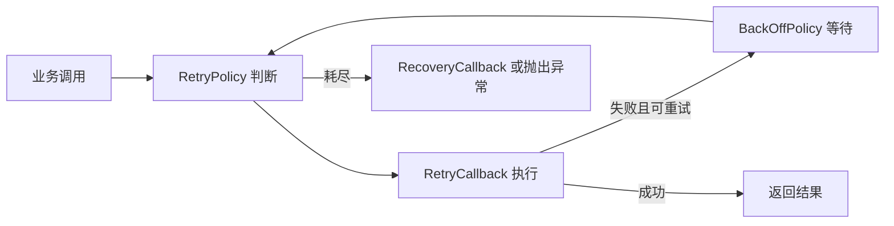

# Spring Retry NES 用户手册

## 1. 文档状态

本手册覆盖当前已验证 SNAPSHOT 行为和仍待完成的 RELEASE 闭环。为避免误用：

- **当前行为**：已由当前源码、POM、JDK 8 双矩阵和 Nexus SNAPSHOT 制品验证；
- **本地已验证行为**：CVE 源码修复已通过测试、覆盖率、制品和消费者验证；
- **已发布行为**：只有 Nexus RELEASE 远端复验后才能标记。

NES SNAPSHOT 已完成本地 Maven repository、Nexus 部署和隔离远端验证。CVE-2026-41710 主状态仍为“修复中”，阶段为“源码与 Nexus SNAPSHOT 已验证，待 RELEASE”。

## 2. 核心模型

Spring Retry 提供两类使用方式：

- 声明式：`@EnableRetry`、`@Retryable`、`@Recover`、`@CircuitBreaker`；
- 命令式：`RetryTemplate`、`RetryPolicy`、`BackOffPolicy`、`RetryState`。

一次重试通常由以下部分组成：



## 3. 坐标与 package

| 阶段 | GAV | 可用性 |
| --- | --- | --- |
| 当前 POM / SNAPSHOT | `cn.bjca.footstone.bpring.retry:bjca-footstone-bpring-retry:1.3.4-nes.patch.1-SNAPSHOT` | 已完成 CVE 源码修复、本地构建、Nexus 隔离验证和消费者验证；不可替代 RELEASE |
| 计划 RELEASE | `cn.bjca.footstone.bpring.retry:bjca-footstone-bpring-retry:1.3.4-nes.patch.1` | 待 release change 与 Nexus 远端验证 |

GAV 变化不改变 Java import。代码继续使用：

```java
import org.springframework.retry.annotation.EnableRetry;
import org.springframework.retry.annotation.Retryable;
import org.springframework.retry.support.RetryTemplate;
```

## 4. 声明式重试

启用代理：

```java
@Configuration
@EnableRetry
public class ApplicationConfiguration {
}
```

定义重试和恢复：

```java
@Service
public class PaymentService {

    @Retryable(
            value = RemoteCallException.class,
            maxAttempts = 3,
            backoff = @Backoff(delay = 500, multiplier = 2.0))
    public PaymentResult submit(PaymentRequest request) {
        // 提交支付请求
        return callRemoteSystem(request);
    }

    @Recover
    public PaymentResult recover(RemoteCallException exception, PaymentRequest request) {
        // 重试耗尽后的业务降级
        return PaymentResult.failed(exception.getMessage());
    }
}
```

关键点：

- `maxAttempts` 包含首次调用；默认值为 3；
- 未配置 include/exclude 时，默认重试 `Exception` 及其子类；
- `backoff` 控制固定、指数等等待策略；
- `@Recover` 可以接收最后异常和原方法参数；
- 使用 `interceptor` 属性时，它与其他 `@Retryable` 策略属性互斥；
- 自调用不经过代理，不能依赖同一实例内部方法调用触发重试。

## 5. 命令式重试

Builder 示例：

```java
RetryTemplate template = RetryTemplate.builder()
        .maxAttempts(4)
        .exponentialBackoff(100, 2.0, 2000)
        .retryOn(RemoteCallException.class)
        .build();

PaymentResult result = template.execute(
        context -> paymentClient.submit(request),
        context -> PaymentResult.failed("重试耗尽"));
```

传统配置示例：

```java
RetryTemplate template = new RetryTemplate();

SimpleRetryPolicy retryPolicy = new SimpleRetryPolicy(3);
FixedBackOffPolicy backOffPolicy = new FixedBackOffPolicy();
backOffPolicy.setBackOffPeriod(1000L);

template.setRetryPolicy(retryPolicy);
template.setBackOffPolicy(backOffPolicy);
```

`RetryTemplate` 可并发使用；配置变更应在应用初始化阶段完成，避免运行中产生难以审计的策略漂移。

## 6. 无状态重试

无状态是默认模式。`RetryContext` 保存在当前调用栈中，重试在一次 `execute` 或代理调用内完成：

```java
@Retryable(value = RemoteCallException.class, maxAttempts = 3)
public String load(String id) {
    return remoteClient.load(id);
}
```

适用于不需要跨事务或跨调用保留重试状态的瞬时失败。CVE-2026-41710 官方公告明确说明默认无状态重试不受该漏洞影响。

## 7. 有状态重试

有状态重试把上下文保存到 `RetryContextCache`，通过业务 key 在后续调用中恢复状态：

```java
@Retryable(
        value = TransientDatabaseException.class,
        stateful = true,
        maxAttempts = 3)
public void update(Order order) {
    // 失败时让事务回滚，后续调用使用相同业务 key 恢复状态
    repository.update(order);
}
```

key 的 `equals()` 和 `hashCode()` 必须稳定，优先使用不可变业务标识。不要把可变对象、随机值或未经约束的攻击者输入直接作为 key。

### 默认 LRU 与严格容量

`MapRetryContextCache` 和 `SoftReferenceMapRetryContextCache` 的默认容量均为 4096。无参和单容量构造器使用线程安全的访问顺序有界 LRU：

- 访问会刷新条目的最近使用顺序；
- 写入第 `capacity + 1` 个不同 key 时驱逐最久未访问条目；
- 缓存 size 不超过 capacity；
- 容量已满时，已有 key 更新仍然成功；
- 真实驱逐会记录固定 WARN，日志不包含 key 或 `RetryContext` 内容。

```java
RetryTemplate template = new RetryTemplate();
template.setRetryContextCache(new MapRetryContextCache(1024));
```

如果业务不能接受旧重试状态被自动驱逐，使用双参数构造器关闭驱逐：

```java
template.setRetryContextCache(new MapRetryContextCache(1024, false));
```

严格模式在满容量后写入不同新 key 时抛 `RetryCacheCapacityExceededException`，但允许已有 key 更新。软引用版本提供相同选择：

```java
template.setRetryContextCache(new SoftReferenceMapRetryContextCache(1024));
template.setRetryContextCache(new SoftReferenceMapRetryContextCache(1024, false));
```

软引用被 GC 回收后，读取会清理对应空引用；它不能替代明确的容量规划和业务 key 约束。

### 普通重试与断路器双缓存

`RetryTemplate` 保留原有普通缓存 setter，并新增独立断路器 setter：

```java
RetryTemplate template = new RetryTemplate();
template.setRetryContextCache(new MapRetryContextCache(2048));
template.setCircuitBreakerRetryContextCache(new MapRetryContextCache(512, false));
```

读取按当前 `RetryPolicy` 选择缓存，写入、检查和删除按 context 的 global-state 属性选择。普通重试与断路器即使使用相同 raw key，也不会互相读取、覆盖或删除状态；普通 LRU 驱逐不会删除同 key 的断路器状态。全局断路器状态不会被普通成功/耗尽路径自动清理。

### 注解式缓存 Bean 规则

建议显式提供两个约定名称：

```java
@Bean(name = "retryContextCache")
public RetryContextCache retryContextCache() {
    return new MapRetryContextCache(2048);
}

@Bean(name = "circuitBreakerRetryContextCache")
public RetryContextCache circuitBreakerRetryContextCache() {
    return new MapRetryContextCache(512, false);
}
```

选择规则：

1. `retryContextCache` 只用于普通有状态重试；
2. `circuitBreakerRetryContextCache` 只用于断路器；
3. 容器中只有一个其他名称的 cache Bean 时，仅回退给普通重试；
4. 存在多个未命名且没有约定名称的 cache Bean 时，不按注册顺序猜测，使用各自安全默认值。

旧应用如果曾依赖唯一 cache Bean 同时控制两类状态，升级时必须改为两个命名 Bean。回滚到旧实现会重新暴露 CVE 攻击路径；未发布阶段可回退本 change，正式发布后只能通过新的 NES patch 修订处理回归。

## 8. 断路器

`@CircuitBreaker` 是有状态重试的一种特殊形式：

```java
@CircuitBreaker(
        value = RemoteCallException.class,
        maxAttempts = 3,
        openTimeout = 5000,
        resetTimeout = 20000)
public String callRemote() {
    return remoteClient.call();
}
```

- `openTimeout`：在该窗口内达到失败阈值时打开断路器；默认 5000 ms；
- `resetTimeout`：打开后经过该时间，下一次调用尝试恢复；默认 20000 ms；
- 当前实现使用固定 circuit key 和全局状态；
- 断路器默认使用独立、非驱逐的严格容量缓存；
- 普通重试的 LRU 驱逐、成功或耗尽清理不会影响断路器状态；
- 自定义断路器 key 策略仍需防止唯一全局 key 填满严格缓存。

## 9. RetryListener

监听器可以观察整个重试生命周期：

```java
public class AuditRetryListener implements RetryListener {

    @Override
    public <T, E extends Throwable> boolean open(
            RetryContext context, RetryCallback<T, E> callback) {
        return true;
    }

    @Override
    public <T, E extends Throwable> void onError(
            RetryContext context, RetryCallback<T, E> callback, Throwable throwable) {
        // 记录脱敏后的失败指标，避免日志放大
    }

    @Override
    public <T, E extends Throwable> void close(
            RetryContext context, RetryCallback<T, E> callback, Throwable throwable) {
        // 清理监听器持有的资源
    }
}
```

- `open` 在首次尝试前执行，返回 `false` 会终止重试；
- `onError` 在每次失败后执行；
- `close` 在最终成功或失败后执行；
- `@Retryable(listeners = {"beanName"})` 可以选择特定监听器；
- 全局 listener Bean 的发现顺序会使用 Spring `OrderComparator` 排序。

当前分支已修复 Spring Framework 5.3 下全局 listener 初始化时机问题。`RetryConfiguration` 在普通 singleton 完成实例化后发现、排序并设置全局 listener；context 就绪后的默认 listener、显式 listener 覆盖和 `StatisticsListener` 均已通过 JDK 8 官方/NES 5.3.39 全量测试。bean 构造期间主动调用 `@Retryable` 方法仍属于不推荐的早期调用模式。

## 10. 异常与恢复

常见异常：

| 异常 | 含义 |
| --- | --- |
| `RetryCacheCapacityExceededException` | 严格模式缓存达到容量后拒绝不同新 key；默认普通 LRU 缓存不会因此永久拒绝新流量 |
| `ExhaustedRetryException` | 有状态重试耗尽且没有可用恢复路径 |
| `TerminatedRetryException` | listener 或内部流程提前终止重试 |
| 原业务异常 | 策略要求重抛，或配置 `throwLastExceptionOnExhausted` |

恢复逻辑必须是幂等且可观测的，不得吞掉安全相关异常或记录未脱敏的请求数据。

## 11. GAV 迁移

迁移步骤：

1. 在消费者仓库创建独立 OpenSpec；
2. 找出官方 Spring Retry 的直接和传递路径；
3. 排除 `org.springframework.retry:spring-retry`；
4. 联调阶段添加已验证的 NES Retry SNAPSHOT；生产升级等待 RELEASE；
5. 确保 Spring Framework 全部为同一套 NES 坐标；
6. 验证 Java import 无需变化；
7. 运行 Maven/Gradle dependency tree 和业务 smoke test；
8. 同步消费者的 GAV、Quick Start、漏洞报告和 Release Notes。

SNAPSHOT 的 Maven/Gradle 示例、受控 deploy 入口和官方 Framework 三属性隔离命令见 [快速入门](QUICK_START.md)。

详细映射见 [GAV 映射](GAV_MAPPING.md)。

## 12. 安全使用建议

- 默认优先使用无状态重试；
- 有状态 key 必须稳定、最小化且受信任；
- 在入口层限制唯一 key 速率、请求大小和失败放大；
- 为缓存容量、驱逐、异常和断路器状态建立指标与告警；
- listener 日志必须限流和脱敏；
- 不把“业务暂未使用”直接解释为组件“免疫”；
- 不把版本号、GAV 或 SNAPSHOT 名称直接解释为“已修复”；
- 生产使用必须等待目标 RELEASE 完成远端制品验证。

## 13. 相关文档

- [快速入门](QUICK_START.md)
- [兼容性说明](COMPATIBILITY.md)
- [测试指南](TESTING.md)
- [漏洞状态总览](VULNERABILITY_REPORT.md)
- [安全策略](../SECURITY.md)
- [发布指南](RELEASE_GUIDE.md)
