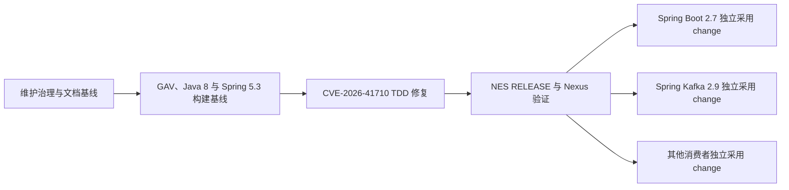

## Context

仓库当前位于 `1.3.x-bjca-patch` 分支，尚无已建立的 OpenSpec capability。构建仍声明 `1.3.5-SNAPSHOT`、Java 1.6 和 Spring Framework 4.3.29，README 又声明 Java 7，三者与已确认的 Java 8、Spring Framework 5.3.x 目标不一致。使用 Spring Framework 5.3.39 与 JDK 8 运行 313 个测试时存在一个失败和一个错误，已定位为全局 `RetryListener` 发现时机过早；此外当前源码仍受 CVE-2026-41710 影响。

参考项目 `spring-framework-5.3` 和 `spring-boot-2.7` 已形成 NES GAV、CVE 总览、单 CVE 文档和发布流程，但存在状态边界重叠、文档状态不同步、归档任务未完成等问题。本设计复用其有效结构，同时收紧状态语义和归档门禁。

约束如下：

- 本 change 仅建立 OpenSpec、治理和永久文档基线，不修改 POM、Java 源码、测试源码或 Nexus。
- 后续任何源码修改必须再次获得明确审批，并严格按 TDD 实施。
- Java package、公共类名和 import 必须保持 `org.springframework.retry.*`。
- 不为 Spring Framework 4.x 或 Java 6/7 保留兼容性承诺。
- 不擅自引入项目未使用的运行时第三方库；JaCoCo 仅作为后续经批准的构建期覆盖率工具。

主要参与方包括 Spring Retry fork 维护者、NES Spring Framework/Spring Boot/Spring Kafka 维护者、Nexus 管理者、业务消费者和安全/SCA 审核人员。

## Goals / Non-Goals

**Goals:**

- 使每项需求、修复、构建变更、文档变更和发布都有完整、可审计的 OpenSpec 工件与批准记录。
- 明确定义支持矩阵、目标 GAV、CVE 状态、文档清单、测试证据和发布门禁。
- 为后续 Spring 5.3 兼容性修复、CVE-2026-41710 backport、GAV 实施和 RELEASE 提供稳定合同。
- 避免仅凭版本号、GAV 或未验证源码宣称漏洞已修复。

**Non-Goals:**

- 本 change 不修复 Spring 5.3 测试失败或 CVE-2026-41710。
- 本 change 不修改 Maven 坐标、依赖、编译版本、Java API 或运行时行为。
- 本 change 不创建或上传任何 SNAPSHOT/RELEASE 制品。
- 本 change 不修改 Spring Boot、Spring Kafka 或业务项目。
- 本 change 不承诺彻底规避所有基于类指纹的 SCA 识别。

## Decisions

### D1：所有变更均使用完整 OpenSpec 生命周期

每个 change 必须具备 `proposal.md`、`design.md`、capability delta specs 和 `tasks.md`，并经历 explore、proposal 审核、apply、验证、文档同步和 archive。仅修改一行配置或文档也不能绕过流程。

替代方案是仅对源码或大变更使用 OpenSpec，但这会重新产生需求与文档无法追溯的问题，因此不采用。

### D2：将维护工作拆成四个独立 change

顺序固定为：维护治理与文档基线、GAV/Spring 5.3 构建及测试基线、CVE-2026-41710 修复、RELEASE 与下游采用。每个 change 独立审批和归档，后一个 change 不得借用前一个 change 的未完成任务。

替代方案是一次完成全部工作，但会混合文档、兼容性、漏洞代码和不可逆发布，审计及回滚风险过高。

### D3：支持矩阵收敛为 Java 8 与 Spring Framework 5.3.x

Java 字节码目标为 1.8；主要验证基线为官方 Spring Framework 5.3.39，并在 GAV 实施后使用 NES Framework `5.3.39-nes.patch.1` 做产品链验证。Spring 4.x 测试结果不再阻断发布，但任何遗留说明必须从文档中删除或明确标记为非支持范围。

### D4：采用组件级 NES GAV

Spring Retry RELEASE 坐标固定为 `cn.bjca.footstone.bpring.retry:bjca-footstone-bpring-retry:1.3.4-nes.patch.1`，开发阶段使用同版本的 `-SNAPSHOT`。非 Framework 组件使用 `.retry` 子 group，与现有 `.boot`、`.kafka`、`.security`、`.data` 约定保持一致。项目为单模块，不额外创建价值有限的 Retry BOM。

保留官方 GAV 的替代方案会继续触发官方漏洞坐标匹配并可能覆盖官方制品，因此不采用。修改 Java package 的替代方案会破坏源码兼容性，也不采用。

### D5：默认发布元数据形成 NES Spring Framework 闭环

后续 GAV change 将把 Framework BOM、`spring-context`、`spring-core`、`spring-test` 和 `spring-tx` 映射到 `cn.bjca.footstone.bpring` 制品。默认 RELEASE effective POM 不得包含官方 `org.springframework:*` 依赖。官方 Spring 5.3.39 兼容性通过隔离验证实现，不将官方坐标写回发布元数据。

### D6：六种 CVE 状态具有互斥语义

“已修复”要求源码、测试和目标制品证据闭环；“免疫”仅用于同一组件范围内但漏洞代码从未存在或攻击路径由产品不变量保证不可达；“不适用”用于其他组件、范围外、误报或正式 disputed；“修复中”要求存在 active OpenSpec change 并记录阶段；“已缓解”表示漏洞仍存在但强制控制已验证；“暂缓”表示明确延期或接受风险，并记录负责人和复审日期。

### D7：永久文档采用单一入口与分层结构

README 只提供项目摘要和文档索引；`doc/VULNERABILITY_REPORT.md` 是 CVE 状态总览的唯一来源，`doc/CVE/` 保存逐项证据；Quick Start 面向首次接入，User Manual 面向完整配置，其他文档分别覆盖 GAV、兼容性、测试和发布。任何状态或坐标变化必须在同一 change 中同步相关文档。

### D8：后续源码 change 强制 TDD 和覆盖率证据

生产代码任务必须按 RED、GREEN、REFACTOR 排列并记录命令结果。新增核心逻辑或复杂算法的覆盖率必须达到 60% 及以上；计划使用 JaCoCo Maven 插件形成可重复证据，纯配置或简单模型豁免必须在 design/tasks 中说明。

### D9：发布采用不可变、证据驱动的门禁

RELEASE 前必须完成全量测试、覆盖率、本地 install、effective POM/依赖树扫描、JAR 元数据检查、消费者 smoke test 和 Nexus 目标不存在检查。部署需要单独明确批准；一旦同版本出现部分制品，不得删除、覆盖或盲目重发，必须提升 NES patch 版本。

### D10：下游仓库独立治理

Spring Boot 2.7、Spring Kafka 2.9 和其他消费者的坐标替换不由本仓库 change 直接修改。每个仓库必须建立自己的完整 OpenSpec，验证依赖树不存在官方/NES 双份类，并同步其 GAV 与漏洞文档。

## Impact Analysis

| 影响面 | 本 change 的直接影响 | 后续影响与边界 |
| --- | --- | --- |
| 当前仓库 | 仅更新 `openspec/config.yaml`、`README.md`、`SECURITY.md` 和 `doc/` | `pom.xml`、`src/`、测试源码与运行时行为保持不变 |
| 上游来源 | 文档记录 Spring Retry 上游来源、兼容修复与安全修复依据 | 不修改、发布或代表上游项目；后续 backport 必须保持许可证和 commit 溯源 |
| 构建元数据 | 只记录当前 GAV、目标 GAV、Java 8/Spring 5.3 目标及差异 | 实际 GAV、依赖和编译级别由后续独立 change 修改 |
| 公共 API | 无直接影响 | Java package、类名、方法签名和 import 必须继续保持 `org.springframework.retry.*` 等现有身份 |
| 运行行为与数据 | 无直接影响，也不新增数据存储、网络入口或权限模型 | 监听器初始化和 CVE 缓存行为只能在后续获批 change 中修改并执行 TDD |
| 安全 | 建立 CVE 证据、六状态词典和敏感信息保护规则；明确当前漏洞尚未修复 | 文档不能被视为缓解或修复，CVE-2026-41710 在制品闭环前保持“修复中” |
| 下游消费者 | 不直接修改 Spring Boot、Spring Kafka 或业务仓库 | RELEASE 后各消费者必须通过独立 OpenSpec 完成 GAV 迁移、依赖去重和 smoke test |
| Nexus 与发布 | 不创建、上传、覆盖或删除制品 | 后续发布必须执行目标不存在检查、单独授权和远端重新下载验证 |
| 测试与覆盖率 | 本 change 仅涉及 Markdown 和声明式 OpenSpec 配置，无可执行逻辑，JaCoCo 覆盖率标记为不适用 | 通过 OpenSpec、链接、状态、坐标、敏感信息和 Git diff 静态校验验收 |
| 回滚 | 可通过恢复本 change 的配置和文档提交完成 | 不涉及数据库、远端制品或运行时状态回滚 |

## Risks / Trade-offs

- [文档先于代码导致读者误认为目标已实现] → 所有文档必须区分“当前状态”“目标状态”“已发布状态”，未发布坐标不得写成可用 RELEASE。
- [能力规格较多，维护成本增加] → 每个 capability 只保存稳定合同，具体实现细节留在 change design/tasks，避免重复。
- [GAV 改名降低生态工具自动识别能力] → 保留完整上游来源、许可证、commit、CVE 和 SBOM/制品证据，不把重品牌当作安全修复。
- [NES 与官方 Spring 类同时出现导致类冲突] → effective POM、dependency tree 和消费者 smoke test 设置重复坐标门禁。
- [Spring 4.x 用户升级受影响] → 在兼容性、Quick Start 和 Release Notes 中明确 Java 8/Spring 5.3 迁移要求。
- [状态文档与实际制品漂移] → “已修复”必须绑定 commit、测试和制品证据；archive 前再次核对总览、单篇文档和任务状态。
- [本地或 Nexus 凭证被写入仓库] → 文档仅引用 Maven settings/server id，不记录用户名、密码、token 或私服敏感配置值。

## Migration Plan

1. Apply 本 change，更新 OpenSpec project context/rules，并创建要求的永久文档；所有内容准确标记当前与目标状态。
2. 验证文档链接、状态统计、GAV 映射和 OpenSpec 校验后归档本 change，使 capability 成为项目基线。
3. 创建第二个 change，实施 NES GAV、Java 8/Spring 5.3 构建基线和全局监听器兼容性修复。
4. 创建第三个 change，以 TDD backport CVE-2026-41710。
5. 创建第四个 change，生成不可变 RELEASE、验证 Nexus，并协调各下游仓库的独立 adoption change。

本 change 回滚只需恢复其 OpenSpec 配置和文档提交，不涉及运行时或远端制品。后续任何已发布 RELEASE 均不得通过删除制品回滚，只能发布新的修订版本并让消费者显式切换。

## Open Questions

- Nexus RELEASE/SNAPSHOT 的最终 repository id、URL 和只读验证地址在发布 change 中从用户 Maven settings 与现有项目发布配置确认，不在本 change 固化敏感值。
- 官方 Spring 5.3.39 隔离兼容验证采用命令行 GAV 参数、临时消费者还是独立测试夹具，将在第二个 change 的 design 中决定。
- Spring Boot 2.7 与 Spring Kafka 2.9 的采用顺序和最终发布时间由各自 OpenSpec 审批决定。
