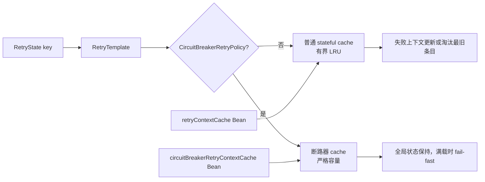

## Context

当前分支 `1.3.x-bjca-patch` 已完成 Java 8、Spring Framework 5.3.x、NES GAV、listener 生命周期、JaCoCo 和本地 SNAPSHOT 基线，但尚未提交或发布。`MapRetryContextCache` 与 `SoftReferenceMapRetryContextCache` 都使用固定容量的同步 `HashMap`；`put` 在 `size >= capacity` 时直接抛异常，连已有 key 更新也失败。`RetryTemplate` 只有一个缓存字段，注解式普通有状态重试与 `@CircuitBreaker` 都由 `AnnotationAwareRetryOperationsInterceptor` 把同一缓存设置到模板。

CVE-2026-41710 / GHSA-2827-2mxx-j8pv 的攻击条件是攻击者能持续控制唯一 stateful key、触发失败并不再重复该 key。上游 commit `6f351edae3d3575fffbde3c0f62fef963dacd152` 和 Spring Retry 2.0.13 sources 提供了 1.3.5 语义：普通缓存使用有界 LRU，断路器使用独立的严格容量缓存，并通过两个命名 Bean 配置。本分支必须把该语义适配为 Java 8、JUnit 4 和 Spring Framework 5.3.x，不复制 Java 17、JUnit 5、AssertJ 或 2.x 的无关重构。

当前工作区包含前一已归档基线 change 的未提交修改以及用户既有 `.codex/`、`.cursor/`。本 change 必须叠加并保留这些内容，不得重置、覆盖或删除。

主要参与方是本 fork 维护者、安全与 SCA 审核人员、使用注解式/命令式有状态重试的业务、使用断路器的应用，以及后续采用该 GAV 的 Spring Boot 2.7、Spring Kafka 2.9 和直接消费者。

## Goals / Non-Goals

**Goals:**

- 消除持续唯一失败 key 让普通有状态重试永久不可用的攻击路径。
- 满容量时允许已有 key 更新，并让普通 map/soft-reference cache 使用可预测的访问顺序 LRU。
- 让普通有状态重试和断路器使用独立缓存，包括相同原始 key 时的读取、更新和删除隔离。
- 提供与上游 1.3.5 可追溯的构造器、setter 和命名 Bean 配置入口，同时保持原有 API 二进制/源码兼容。
- 严格执行 JUnit 4 RED、最小 GREEN、REFACTOR、官方/NES 双矩阵、JaCoCo、制品和消费者闭环。
- 同步永久文档；本 change 完成后主状态仍为“修复中（源码与 Nexus SNAPSHOT 已验证，待 RELEASE）”。

**Non-Goals:**

- 不把普通缓存改为无界缓存，也不保证被 LRU 淘汰的业务重试上下文永久保存。
- 不静默驱逐断路器全局状态；断路器缓存继续在新增 key 超容量时 fail-fast。
- 不改变 `RetryContextCache` 接口、Java package、项目 GAV、Java 8 或 Spring Framework 5.3.x 支持合同。
- 不引入 Caffeine、Guava 或其他运行时依赖，不升级 JUnit、Spring、Maven 插件或测试框架。
- 不在本 change 实际生成/部署 RELEASE，不打 tag、不 push、不修改下游仓库，不把 CVE 状态提前改为“已修复”。追加授权允许当前 `1.3.4-nes.patch.1-SNAPSHOT` 写入内部 snapshot repository 并做远端验证，也允许 Makefile 实现受显式确认保护的 RELEASE deploy 能力；实际 RELEASE 写入仍需后续 release change 和单独授权。

## Decisions

### D1：回移共享 `AbstractMapRetryContextCache`，同时覆盖强引用与软引用缓存

新增 Java 8 语法的 `AbstractMapRetryContextCache<V>`，集中实现容量、同步 map、LRU/严格模式、已有 key 更新、日志和基本 CRUD。`MapRetryContextCache` 与 `SoftReferenceMapRetryContextCache` 只负责 value 转换并保留现有无参、单 `int` 构造器和 `setCapacity`；新增 `(int, boolean removeEldestEntries)` 构造器与上游 1.3.5 对齐。

只修改 `MapRetryContextCache` 的替代方案会让公开的 soft-reference 实现继续保留同一容量耗尽缺陷，因此不采用。复制两份 LRU 逻辑会增加并发与行为漂移风险，也不采用。

### D2：普通缓存默认 LRU，断路器缓存默认严格容量

无参和单 `int` 构造器使用访问顺序 `LinkedHashMap`，插入第 `capacity + 1` 个不同 key 时在同一 put 中淘汰最旧访问条目并记录 WARN。`(capacity, false)` 使用严格模式：仅当新 key 使容量超限时抛 `RetryCacheCapacityExceededException`，已有 key 更新始终允许。

将所有缓存都改成 LRU 会丢失不应自动关闭的断路器全局状态；所有缓存都继续 fail-fast 又无法修复普通重试攻击路径，因此采用双策略。

### D3：在 `RetryTemplate` 内部按策略与上下文双向路由缓存

`RetryTemplate` 保持 `setRetryContextCache` 的既有公开入口，并新增上游同名 `setCircuitBreakerRetryContextCache`。内部 composite 保存普通与断路器两个 cache：打开上下文前按 `CircuitBreakerRetryPolicy` 选择读取缓存，写入/一致性检查/删除时按上下文的 `state.global` 属性选择。

上游 2.0.13 的 raw-key lookup 会先查普通缓存再查断路器缓存；若两类缓存同时存在相同原始 key，读取可能命中错误类型。为满足已批准的“相同业务 key 隔离”合同，本 backport 在不新增公共 API 的前提下按 retry policy 选择读取端，这是对上游补丁的最小局部加固。测试必须证明普通状态的清理和 LRU 驱逐不会读取或删除同 key 的断路器状态。

通过给 key 加字符串前缀实现隔离的替代方案会改变自定义 cache 可见的 key，破坏现有集成与监控，因此不采用。

### D4：命名 Bean 优先，唯一 Bean 仅回退给普通缓存

`RetryConfiguration` 按以下顺序选择：

1. 名为 `retryContextCache` 的 Bean 用于普通有状态重试；不存在时，若上下文中只有一个 `RetryContextCache`，保持旧行为并用于普通重试。
2. 名为 `circuitBreakerRetryContextCache` 的 Bean 仅用于断路器；不存在时使用 interceptor/template 的独立严格默认缓存，不把唯一普通 Bean 隐式复用到断路器。

这与上游 1.3.5 规则一致，同时避免升级后一个自定义普通 LRU 缓存继续承载全局断路器状态。两个命名 Bean 同时存在时必须分别装配；多个未命名 Bean 且无约定名称时不猜测。

### D5：容量相关复合操作在同一 map monitor 下完成

虽然 `Collections.synchronizedMap` 能保护单次方法调用，但严格模式的 `containsKey + size + put` 是复合操作。实现将在同一 map monitor 下完成检查与写入，`setCapacity` 也使用相同 monitor，避免并发新 key 短暂突破严格容量或错误拒绝已有 key。LRU 的访问顺序更新继续由 synchronized map 保护。

不引入额外锁类或并发缓存库，避免新的死锁面和供应链依赖。WARN 仅在实际 LRU 淘汰时产生，不记录 key/context，防止敏感业务标识泄露和日志内容注入。

### D6：TDD 证据按层分离

RED 阶段只允许修改测试：

- policy 层验证已有 key 更新、LRU 访问顺序、严格模式、soft-reference 行为和并发容量边界；
- support 层验证持续唯一 key、普通/全局相同 key 路由与清理；
- annotation 层验证两个命名 Bean、唯一 Bean 回退和默认独立缓存。

每组 RED 必须在当前漏洞生产代码上因目标行为缺失而失败，而不是因编译错误或测试夹具错误。GREEN 之后先定向回归，再运行官方/NES clean verify；JaCoCo 对本 change 新增/修改的核心类行覆盖率至少 60%，不通过排除或降低门禁规避。

### D7：SNAPSHOT 远端闭环后仍不提前完成 CVE

本 change 生成并部署的仍是 `1.3.4-nes.patch.1-SNAPSHOT`。即使源码、测试、Nexus SNAPSHOT 四件套和远端消费者都通过，CVE 主状态仍是“修复中”，阶段更新为“源码与 Nexus SNAPSHOT 已验证，待 RELEASE”。只有正式目标 RELEASE 制品完成远端验证后才能在发布 change 中转为“已修复”。

### D8：Makefile 封装完整门禁，并对 RELEASE 增加显式确认

仓库根新增 Maven 导向的 `Makefile`，参考 NES Spring Framework/Spring Boot 项目的中文帮助与显式 target 风格，提供 `help`、`clean`、`test`、`verify`、`verify-official`、`install-local`、`deploy` 和 `validate`。默认工具链为 SDKMAN JDK `8.0.472-amzn` 与 `~/dev/apache-maven-3.8.2/bin/mvn`，通过 `JAVA8_HOME`、`DEV_ROOT`、`MAVEN` 和 `OPENSPEC` 变量允许维护机覆盖。

`verify` 执行默认 NES `clean verify`；`verify-official` 一次性覆盖 Framework 三属性；`install-local` 只写本地 Maven repository；`validate` 执行全项目 OpenSpec strict 与 `git diff --check`。`deploy` 执行完整 Maven `clean deploy` 生命周期，不跳过测试/覆盖率/Javadoc，并在执行前解析项目版本：SNAPSHOT 校验 `nexusSnapshotUrl` 后可继续；非 SNAPSHOT 视为 RELEASE，只有显式设置 `ALLOW_RELEASE_DEPLOY=true` 且 `nexusReleaseUrl` 可解析时才允许继续。仍不提供独立 `release`、`tag` 或 `push` target。Makefile 属于构建编排，JUnit 覆盖率不适用；使用 dry-run、帮助输出、两种版本门禁、静态扫描、真实 `make verify` 和授权后的远端制品验证。

### D9：沿用 NES 属性化 distributionManagement，由版本选择目标仓库

参考 `/Users/anan/Documents/GitHub/nes/logback`，POM 增加 `releases` 与 `snapshots` 两个 repository id，URL 分别引用 `${nexusReleaseUrl}` 和 `${nexusSnapshotUrl}`，由本机 Maven settings 的 active profile 注入；仓库和文档不保存真实地址或认证值。Maven 按项目版本自动选择目标：`-SNAPSHOT` 使用 `snapshotRepository`/server id `snapshots`，其他版本使用 `repository`/server id `releases`。

部署前 `make deploy` 必须校验版本对应的 URL 属性可解析；RELEASE 还必须显式提供 `ALLOW_RELEASE_DEPLOY=true`，并由独立 release change 完成分支/HEAD 冻结、目标不存在检查和单独部署授权。部署生命周期必须重新运行 328 tests、JaCoCo、Javadoc 和四件套。当前 SNAPSHOT 部署成功后使用隔离临时 Maven repository 强制更新解析同一 GAV，检查远端 POM、主 JAR、sources、javadoc、字节码、修复类/API 和 NES-only dependency tree。SNAPSHOT 远端验证不能把 CVE 主状态改为“已修复”，只能把阶段更新为“源码与 Nexus SNAPSHOT 已验证，待 RELEASE”。

### 上游逐文件适配边界

| 上游文件/语义 | 本分支处理 | 差异理由 |
| --- | --- | --- |
| `AbstractMapRetryContextCache` | 手工回移并使用 Java 8 泛型语法；严格检查与写入增加同 monitor 原子性 | 上游复合检查不是原子操作，本 change 已批准并发容量边界 |
| `MapRetryContextCache` | 回移继承关系、默认 LRU 与双参数构造器 | 保留 1.3.x 现有无参/单参数/setter API |
| `SoftReferenceMapRetryContextCache` | 回移继承关系、默认 LRU、双参数构造器与软引用清理 | 防止公开 soft-reference 实现继续保留相同缺陷 |
| `RetryTemplate` composite cache | 回移双缓存、setter、按 context 写/删；读取改为按 retry policy 选择 | 避免上游 stateful-first raw-key lookup 在同 key 时返回错误类型 |
| `AnnotationAwareRetryOperationsInterceptor` | 只回移独立断路器缓存字段、setter、默认值与 template 装配 | 不带入 2.x 表达式、lambda、Java 17 或其他 annotation 重构 |
| `RetryConfiguration` | 回移两个命名 Bean 规则和 advice 装配 | 保留已完成的 listener singleton 生命周期修复和 Java 8 写法 |
| 上游测试 | 按 JUnit 4/现有断言风格重写，并增加并发和 same-key 场景 | 不升级 JUnit 5、AssertJ 或测试栈 |

明确不采用上游 2.x 的 Java 17 source level、lambda/diamond 语法、nullable 注解调整、表达式求值重构、listener/API 无关变化、构建插件版本变化及发布元数据。

## Impact Analysis

| 影响面 | 直接影响 | 边界与验证 |
| --- | --- | --- |
| 上游来源 | 手工适配 commit `6f351eda...` / 2.0.13 sources | 记录逐文件差异，不 cherry-pick Java 17/JUnit 5/无关表达式重构 |
| policy 模块 | 新增抽象基类，修改 map 与 soft-reference cache 默认容量行为 | 原构造器/方法保留；新增构造器与上游 1.3.5 对齐；定向与并发测试 |
| support 模块 | `RetryTemplate` 内部由单缓存变为双缓存路由 | 保留 `setRetryContextCache`，新增断路器 setter；命令式重试与断路器回归 |
| annotation 模块 | interceptor 和 configuration 分别装配两类缓存 | 命名 Bean、唯一回退、默认路径和 listener 生命周期联合验证 |
| 公共 API | 新增上游同源 public/protected 类型和 setter，不删除或改签名 | `javap`、Javadoc、sources JAR、Java 8 消费者编译验证 |
| 构建元数据 | 不改 GAV、Framework 属性、插件或运行依赖 | effective POM/dependency tree/JAR 内容确认无新依赖 |
| 本地构建入口 | Makefile 封装 Maven/OpenSpec，并支持 SNAPSHOT/RELEASE deploy | 版本对应 URL 前置检查、RELEASE 显式确认、完整生命周期、无 Git tag/push |
| Nexus 发布仓库 | 新增属性化 distributionManagement；已上传当前 SNAPSHOT，RELEASE 仅提供受控入口 | 不固化 URL/凭证；版本自动选择 id；实际 RELEASE 仍需独立 change 和授权 |
| 运行行为 | 普通默认缓存从满载异常改为 LRU；断路器仍严格容量 | User Manual/Release Notes 说明权衡和显式 fail-fast 配置 |
| 数据与可用性 | 缓解全局 DoS；LRU 可能使旧重试状态提前丢失 | 容量可配置、WARN、残余风险和运维监控文档 |
| 下游消费者 | Java import 不变；双命名 Bean 为可选迁移点 | Maven/Gradle smoke test；下游仓库仍需独立 OpenSpec |
| 回滚 | 未发布前可回退本 change 的源码/测试/文档 | 已发布版本不得覆盖；问题通过新 NES patch 修订 |

安全前置分析：

- 资源耗尽：本 change 的直接目标；普通缓存始终有界且不永久拒绝新流量，断路器保持严格保护。
- 注入：不新增 SQL、SpEL、命令、模板或网络输入解析；WARN 使用固定文本且不拼接 key。
- 越权：不新增 endpoint、身份、权限或 Bean 访问能力；命名 Bean 只从既有 Spring 容器选择指定类型。
- 路径处理：不新增文件路径或归档提取逻辑；测试证据使用固定本地临时目录。
- 反序列化：不新增序列化格式；soft-reference cache 只保存进程内既有 `RetryContext`。
- 供应链：不新增运行依赖；上游 sources 只作比对，最终 dependency tree 和 JAR 必须无额外库。

## Risks / Trade-offs

- [LRU 淘汰尚未完成的状态，后续相同 key 被视为新重试] → 文档明确语义，容量可调，记录 WARN，并保留 `(capacity, false)`/自定义 cache 的 fail-fast 选择。
- [高并发下容量检查、淘汰和访问顺序竞态] → 复合写入与容量更新在同一 monitor 下完成，增加并发压力测试并记录仍依赖调用者 key 稳定性的残余风险。
- [断路器严格缓存仍可能被恶意唯一全局 key 填满] → 注解式断路器使用固定方法 key 且与普通缓存隔离；文档要求监控容量异常，自定义 key 策略仍需下游限流。
- [相同 raw key 在双缓存中碰撞] → 读取端按 retry policy 选 cache，写/删端按 global 属性选 cache，并建立同 key 回归测试。
- [命名 Bean 规则改变自定义配置预期] → 唯一 Bean 继续回退给普通重试；断路器不再隐式复用，提供两个命名 Bean 的迁移示例。
- [WARN 在攻击期间放大日志] → 每次真实淘汰最多一条固定 WARN，不包含 key；文档建议对 logger 做速率监控，暂不新增日志限流依赖。
- [未提交基线与本 change diff 混合] → 以归档 change、任务清单和文件级 diff 审计区分，不重置用户工作区。

## Migration Plan

1. 创建并严格校验本 change 的 proposal、design、delta specs 和 tasks，记录用户源码授权。
2. 在当前生产代码上只增加 JUnit 4 测试，取得可解释的 RED；生产 diff 必须仍为空（不含既有已批准 listener 基线）。
3. 最小回移抽象缓存、两种 cache、`RetryTemplate` 双路由、interceptor setter 和 configuration Bean 选择，完成 GREEN/REFACTOR。
4. 使用真实 JDK 8 分别运行官方 Spring 5.3.39 与默认 NES 5.3.39 clean verify、JaCoCo、依赖树、字节码、制品和消费者验证。
5. 上传并隔离验证当前 Nexus SNAPSHOT，把阶段更新为“源码与 Nexus SNAPSHOT 已验证，待 RELEASE”。
6. 为 `make deploy` 增加 RELEASE 显式确认能力，更新所有受影响永久文档，再执行最终默认 NES clean verify 和静态门禁；本 change 不实际部署 RELEASE。
7. 用户验收后同步主 specs 并归档本 change；随后另建实际 RELEASE change。

未发布前如发现回归，可只回退本 change 引入的缓存/路由代码和测试，恢复到已归档基线，但 CVE 将继续阻断发布。发布后不得删除或覆盖制品，必须创建新的 OpenSpec change 和 `-nes.patch.N+1` 修订。

## Open Questions

- RELEASE repository id 已固定为 `releases`，URL 继续由本机 settings 的 `nexusReleaseUrl` 注入；目标不存在检查、实际授权、部署和远端验证仍由后续独立 release change 决定，本 change 不读取、输出或固化真实值。
- 下游业务是否已经定义单个自定义 `RetryContextCache` 供两类状态共用，需要各下游 adoption change 通过 dependency/configuration audit 确认；本仓库提供兼容规则和示例，不直接修改下游。
